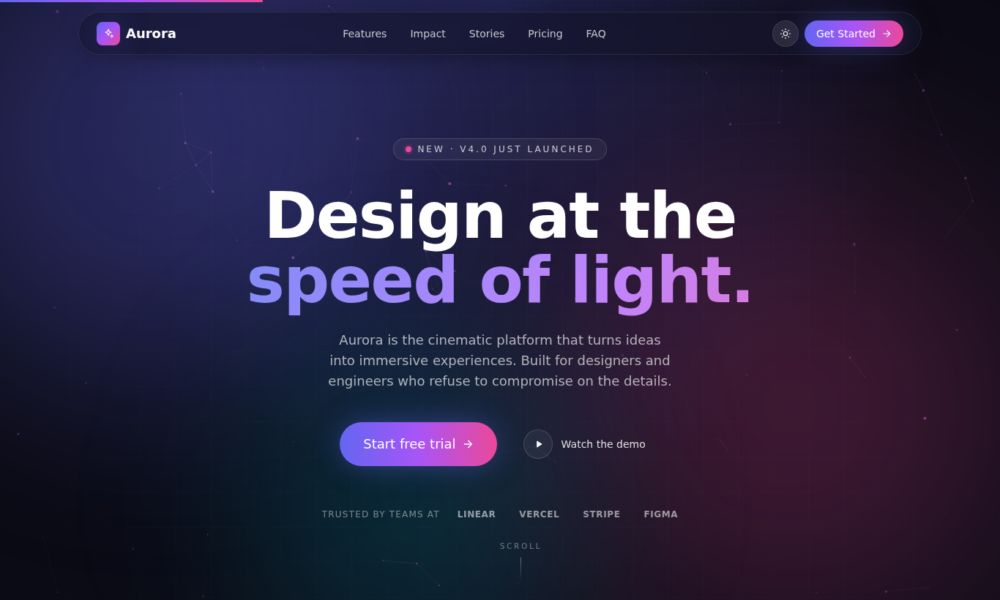

# Lukas Voss — Cinematic Freelancer Portfolio

A premium, motion-first portfolio for an independent web designer & developer. Built with **React 18**, **TypeScript**, **Tailwind CSS**, **Framer Motion** and **Three.js** — engineered for speed, accessibility and a high-end agency feel.



## Launch in GitHub Codespaces — one click

[](https://codespaces.new/JohnBlik/awesome-claude-code-toolkit?devcontainer_path=examples%2Fcinematic-landing-page%2F.devcontainer%2Fdevcontainer.json)

1. Click the badge (or **Code → Codespaces → Create codespace on …** on GitHub, then pick this devcontainer path).
2. Wait while Codespaces provisions the container and runs `npm install` (~45–60 s the first time).
3. The Vite dev server starts automatically via a workspace task; Codespaces detects the bound port and opens a live preview tab.

No local Node, no terminal commands — the badge is the workflow.

### How the one-click setup works

| Piece                                        | What it does                                                                                 |
| -------------------------------------------- | -------------------------------------------------------------------------------------------- |
| `.devcontainer/devcontainer.json`            | Node 22 image, `workspaceFolder` pinned to this example, `postCreateCommand: npm install`.   |
| `.vscode/tasks.json` (`runOn: folderOpen`)   | Auto-runs `npm run dev` the moment VS Code finishes opening the workspace.                   |
| `vite.config.ts` — `server.host: true`       | Binds Vite on `0.0.0.0` so the forwarded Codespaces URL can reach it.                        |
| `vite.config.ts` — `strictPort: false`       | Vite auto-detects the next free port if `5173` is busy.                                      |
| `forwardPorts: [5173]` + `onAutoForward`     | Codespaces labels the port `Vite — Cinematic Landing Page` and opens the preview tab.        |

## Click-and-open single HTML file

Want the whole portfolio as one file you can email or open with a double-click? Build it:

```bash
npm install
npm run build:single
```

That produces `portfolio.html` (≈ 860 KB) with **every** asset inlined — React, Framer Motion, Three.js, all CSS, all icons, even the favicon as a data URI. No server, no `node_modules`, no relative paths. Open it from your file manager, drag it into a browser, attach it to an email — it just works.

```
file:///path/to/portfolio.html
```

`npm run build:single` runs Playwright-friendly post-processing (`scripts/finalize-single.mjs`) and you can validate the result with:

```bash
node scripts/verify-single.mjs    # boots the file:// build in headless Chromium
```

## Local development

```bash
npm install
npm run dev        # http://127.0.0.1:5173 (or next free port)
```

### Available scripts

| Script               | Purpose                                          |
| -------------------- | ------------------------------------------------ |
| `npm run dev`        | Vite dev server (auto-detects a free port).      |
| `npm run build`      | Type-check + production bundle.                  |
| `npm run preview`    | Serve the production build (port `4173`).        |
| `npm run lint`       | ESLint over `.ts` / `.tsx`.                       |

## Highlights

- **Cinematic 3D background** — a low-poly Three.js scene (starfield + wireframe icosahedrons + two point lights) reacts to mouse + scroll. Lazy-loaded, paused via `IntersectionObserver` and `visibilitychange`, DPR-capped, mobile-aware.
- **Custom cursor** — two-layer cursor (dot + lagging ring) with magnetic hover states; auto-disabled on coarse-pointer devices.
- **Magnetic buttons** — Framer Motion spring-based pull on the primary CTAs.
- **Typewriter hero** — phrase rotation honoring `prefers-reduced-motion`.
- **Animated skill bars** — fire on in-view.
- **Portfolio grid** — animated filter pills (`layoutId`), modal preview with a faux-browser project mock, Escape-to-close and focus trapping basics.
- **Testimonials carousel** — autoplay, pause on hover, dot-tab navigation, animated direction.
- **Pricing** — per-project / monthly retainer toggle with shared `layoutId` pill.
- **Contact form** — client-side validation, multi-select interests, animated success state.
- **Effects everywhere** — loading screen, scroll progress bar, aurora gradient blobs, glassmorphism, smooth section transitions, animated navbar with mobile hamburger menu.
- **Accessibility** — keyboard navigation, skip link, ARIA roles for tabs/dialog/expanded/pressed, focus-visible rings, complete `prefers-reduced-motion` fallbacks.
- **SEO basics** — descriptive `<title>`, Open Graph + Twitter card, JSON-LD `Person` schema, semantic landmarks.

## Sections

1. **Hero** — name, role, availability pill, typing animation, magnetic CTA.
2. **About** — bio, four stat cards, animated skill bars.
3. **Services** — six glassmorphism service cards with topic tags.
4. **Portfolio** — filterable project grid with modal previews.
5. **Process** — five-step animated timeline.
6. **Testimonials** — autoplay carousel.
7. **Pricing** — three tiers with project / monthly toggle.
8. **Contact** — animated form with budget chips, interest tags & validation.
9. **Footer** — minimalist with social links.

## Stack

| Concern         | Tool                       |
| --------------- | -------------------------- |
| Framework       | React 18 + Vite 5          |
| Language        | TypeScript                 |
| Styling         | Tailwind CSS 3             |
| Animation       | Framer Motion 11           |
| 3D / WebGL      | Three.js                   |
| Smoke tests     | Playwright                 |

### Tests & scripts

`scripts/smoke-test.mjs` is a Playwright end-to-end harness that exercises every interaction surface: rendering, the typewriter, all section anchors, the portfolio filter & modal (incl. Escape), the testimonials carousel, the pricing toggle, contact form validation + submit, the theme toggle, the mobile menu, and the reduced-motion variant. It also fails if any unexpected JS console error occurs.

```bash
# In one terminal:
npm run dev
# In another:
node scripts/smoke-test.mjs
node scripts/perf-check.mjs           # nav timings
node scripts/screenshot-modal.mjs     # capture portfolio modal + contact
```

## Bundle size

After `npm run build` (gzip transfers, deferred / lazy chunks marked ⏳):

| Chunk                      | Min KB | Gzip KB | Notes                              |
| -------------------------- | -----: | ------: | ---------------------------------- |
| `index` entry              |   27.7 |     9.0 | App shell + Hero                   |
| `react` vendor             |    134 |    43.1 | React + ReactDOM                   |
| `motion` vendor            |    130 |    43.4 | Framer Motion                      |
| `three` vendor ⏳           |    503 |   126.9 | Loaded after first paint           |
| `index.css`                |   40.5 |     7.6 | Tailwind + custom layers           |
| each section (lazy) ⏳     |   ~1–11|  ~1–4   | About, Services, … Contact         |

**Initial render payload:** `react + motion + entry + css` ≈ **103 KB gzip**. Everything else — sections, Three.js, the portfolio modal, etc. — streams in as you scroll.

## Folder structure

```
.devcontainer/
└── devcontainer.json          # One-click Codespaces config (Node 22, port 5173 auto-forwarded)
.vscode/
└── tasks.json                 # Auto-runs `npm run dev` on folderOpen
src/
├── App.tsx                       # Page composition + Suspense boundaries
├── main.tsx                      # React entry
├── styles/index.css              # Tailwind layers + custom utilities
├── data/                         # All content (single source of truth)
│   ├── personal.ts               # name, bio, skills, socials, phrases
│   ├── portfolio.ts              # project list + categories
│   ├── services.ts               # service cards
│   ├── process.ts                # process steps
│   └── testimonials.ts           # testimonials
├── hooks/
│   ├── useReducedMotion.ts
│   ├── useTheme.ts               # dark/light w/ localStorage persistence
│   └── useTypewriter.ts          # phrase-rotation hook
├── lib/
│   ├── cn.ts                     # className helper
│   └── motion.ts                 # shared Framer Motion variants
└── components/
    ├── effects/
    │   ├── AuroraBlobs.tsx       # animated gradient blobs
    │   ├── CustomCursor.tsx      # two-layer custom cursor
    │   ├── LoadingScreen.tsx     # initial loader
    │   ├── ScrollProgress.tsx    # top progress bar
    │   └── ThreeBackground.tsx   # Three.js scene (lazy-loaded)
    ├── layout/
    │   ├── Footer.tsx            # minimalist footer
    │   └── Navbar.tsx            # animated, glass-on-scroll, mobile menu
    ├── sections/
    │   ├── Hero.tsx
    │   ├── About.tsx
    │   ├── Services.tsx
    │   ├── Portfolio.tsx         # grid + modal
    │   ├── Process.tsx
    │   ├── Testimonials.tsx      # carousel
    │   ├── Pricing.tsx
    │   └── Contact.tsx           # form w/ validation
    └── ui/
        ├── Button.tsx            # polymorphic button/anchor
        ├── GlassCard.tsx         # glassmorphism container w/ glow
        ├── Icon.tsx              # inline SVG icon set
        ├── MagneticButton.tsx    # spring-magnetic wrapper
        ├── Modal.tsx             # focus-aware modal w/ Escape + scroll lock
        ├── SectionHeader.tsx     # eyebrow + title + description
        └── Tag.tsx               # tech tag pill
```

## Customising it for yourself

All copy lives in `src/data/*`. Replace the contents of `personal.ts`, `portfolio.ts`, `services.ts`, `process.ts` and `testimonials.ts` — no component edits required.

```ts
// src/data/personal.ts
export const personal = {
  name: 'Your Name',
  initials: 'YN',
  role: 'Independent Web Designer & Developer',
  rotatingPhrases: ['websites that perform.', 'commerce that converts.', ...],
  ...
};
```

The icon set is in `src/components/ui/Icon.tsx`. Add a new SVG `path` and a new entry to the `IconName` union.

## Accessibility

- **Skip link** to main content, surfaced on first Tab.
- **Reduced motion** is respected — typewriter, Three.js scene, blobs, parallax, carousel autoplay and Framer Motion durations all short-circuit when the user prefers it.
- **Focus styles** are visible everywhere (`:focus-visible` outline ring).
- **ARIA**: navbar (`aria-expanded`), pricing & filter (`aria-pressed`/`aria-selected`), modal (`role="dialog"`, `aria-modal`, `aria-labelledby`), testimonials tabs, social links labelled.
- **Custom cursor** auto-disables on `pointer: coarse` (touch devices) and never hides cursor on form inputs.

## Performance

- Three.js, every section and the footer are **lazy-loaded** through `React.lazy` + `Suspense`.
- Vite `manualChunks` splits `react`, `framer-motion` and `three` into long-lived vendor bundles.
- The Three.js renderer caps DPR at 1.5, uses `antialias: false`, and **pauses** the render loop when the canvas is offscreen or the tab is hidden.
- The cursor and magnetic spring run on GPU-friendly transforms only.
- `will-change: transform` is set on long-lived animated layers only (aurora blobs).
- Fonts are non-blocking with a `<link rel="preload" as="style" onload>` swap and a `<noscript>` fallback.

## License

MIT — use it, fork it, ship something beautiful.
